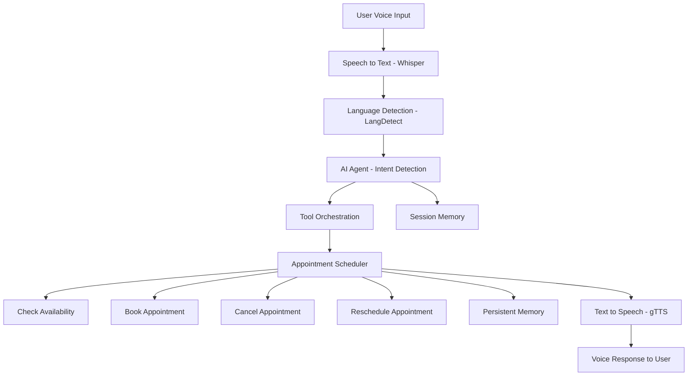

## System Architecture

```mermaid
flowchart TD

A[User Voice Input] --> B[Speech to Text - Whisper]

B --> C[Language Detection - LangDetect]

C --> D[AI Agent - Intent Detection]

D --> E[Tool Orchestration]

E --> F[Appointment Scheduler]

F --> G[Check Availability]
F --> H[Book Appointment]
F --> I[Cancel Appointment]
F --> J[Reschedule Appointment]

D --> K[Session Memory]

F --> L[Persistent Memory]

F --> M[Text to Speech - gTTS]

M --> N[Voice Response to User]
```
